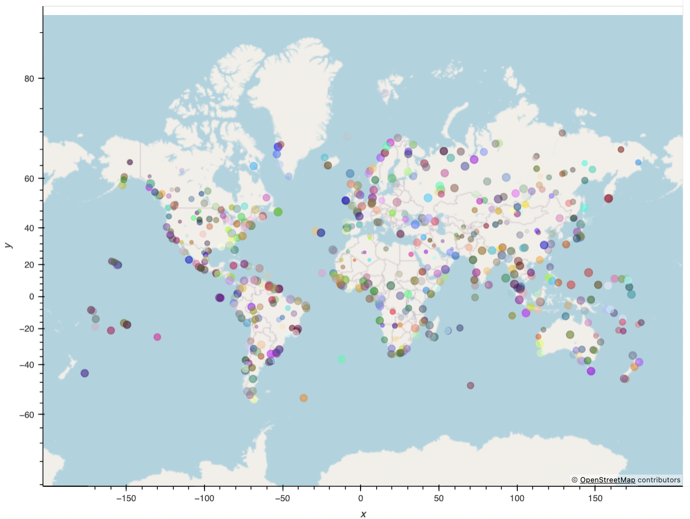

# Python API Challenge

Visualise the weather for over 500 cities and find the perfect vacation destination!

Created and submitted for an assignment for Monash University Data Analytics Boot Camp (July 2023).

## Table of Contents

- [General info](#general-info)
- [Technologies](#technologies)
- [Screenshot](#screenshot)
- [Code example](#code-example)
- [References](#references)

## General info

### WeatherPy
- Finds hundreds of cities using randomly-generated latitude and longitude coordinates.  
- Exports these cities as a CSV file for VacationPy.
- Fetches the weather for each city found using the openweathermap api.
- Creates various graphs to examine trends in weather (eg. temperature and humidity) based on latitude.

### VacationPy
- Reads in data from cities_mine.csv file generated in WeatherPy.
- Visualises the humidity of each city in cities_mine.csv using hvplot.
- Finds cities with the perfect weather based on various parameters (eg. maximum temperature).
- Creates DataFrame containing these cities.
- Finds the nearest hotel for each city using geoapify and plots them using hvplot.

## Technologies

Project created and run using:

- Python 3.10.9
- Visual Studio Code 1.79.2

## Screenshot

#### Humidity of various cities around the world



## Code example

```python
# Code Snippet from VacationPy.ipynb 

# Set parameters to search for a hotel
categories = "accommodation.hotel"
radius = 10000
params = {
    "categories":categories,
    "limit":1,
    "apiKey":geoapify_key}
    
# Print a message to follow up the hotel search
print("Starting hotel search")

# Iterate through the hotel_df DataFrame
for index, row in hotel_df.iterrows():
    
    # get latitude, longitude from the DataFrame
    longitude = row['Lng']
    latitude = row['Lat']
    
    # Add filter and bias parameters with the current city's latitude and longitude to the params dictionary
    params["filter"] = f'circle:{longitude},{latitude},{radius}'
  
    # Set base URL
    base_url = "https://api.geoapify.com/v2/places"

    # Make and API request using the params dictionaty
    name_address = requests.get(base_url, params=params)

    # Convert the API response to JSON format
    name_address = name_address.json()
     
    # Grab the first hotel from the results and store the name in the hotel_df DataFrame
    try:
        hotel_df.loc[index, "Hotel Name"] = name_address["features"][0]["properties"]["name"]
    except (KeyError, IndexError):
        # If no hotel is found, set the hotel name as "No hotel found".
        hotel_df.loc[index, "Hotel Name"] = "No hotel found"
        
    # Log the search results
    print(f"{hotel_df.loc[index, 'City']} - nearest hotel: {hotel_df.loc[index, 'Hotel Name']}")

# Display sample data
hotel_df
```

## References

- Code, in general, was adapted from Monash University Data Analytics Boot Camp 2023 course learning material.


Created and written by Samuel Palframan - July 2023.
